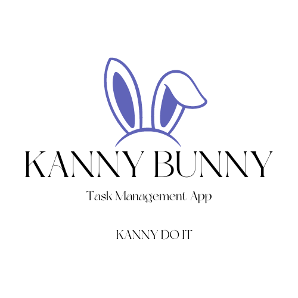

# 🐰 Kanny Banny - Task Management Dashboard

A modern, intuitive task management application built with React and Material-UI, featuring a drag-and-drop interface and real-time updates.



## ✨ Features

- **📋 Board Management**
  - Create, edit, and delete boards
  - Drag-and-drop functionality for tasks
  - Real-time updates
  - Inline editing for board titles and descriptions

- **⭐ Favorites System**
  - Mark boards as favorites
  - Quick access to favorite boards
  - Recent boards tracking
  - Customizable board order

- **👤 User Features**
  - Secure authentication
  - Personalized dashboard
  - User preferences saving
  - Recent activity tracking

- **🎨 Modern UI/UX**
  - Material Design components
  - Responsive layout
  - Intuitive navigation
  - Dark/light theme support

## 🚀 Tech Stack

- **Frontend**
  - React
  - Redux Toolkit (State Management)
  - Material-UI (Component Library)
  - React Beautiful DND (Drag & Drop)
  - React Router (Navigation)

- **Backend**
  - Node.js
  - Express
  - MongoDB
  - JWT Authentication

## 🛠️ Installation

1. **Clone the repository**
   ```bash
   git clone https://github.com/yourusername/kanny-banny.git
   cd kanny-banny
   ```

2. **Install dependencies**
   ```bash
   # Install frontend dependencies
   cd frontend
   npm install

   # Install backend dependencies
   cd ../backend
   npm install
   ```

3. **Set up environment variables**
   ```bash
   # In backend directory
   cp .env.example .env
   # Edit .env with your MongoDB URI and JWT secret
   ```

4. **Start the development servers**
   ```bash
   # Start backend (from backend directory)
   npm run dev

   # Start frontend (from frontend directory)
   npm start
   ```

## 🌐 Deployment

The application is deployed using:
- Frontend: [Vercel](https://vercel.com)
- Backend: [Render](https://render.com)

Visit the live application: [Kanny Banny App](your-deployment-url-here)

## 📱 Usage

1. **Authentication**
   - Register a new account or login
   - Secure password storage

2. **Board Management**
   - Create a new board from the sidebar
   - Click board title to edit
   - Drag boards to reorder
   - Star boards to add to favorites

3. **Task Management**
   - Create tasks within boards
   - Drag tasks between columns
   - Edit task details inline
   - Mark tasks as complete

4. **Favorites & Recent**
   - Click star icon to favorite
   - Access recent boards from sidebar
   - Quick navigation to frequent boards

## 🤝 Contributing

1. Fork the repository
2. Create your feature branch (`git checkout -b feature/AmazingFeature`)
3. Commit your changes (`git commit -m 'Add some AmazingFeature'`)
4. Push to the branch (`git push origin feature/AmazingFeature`)
5. Open a Pull Request

## 📄 License

This project is licensed under the MIT License - see the [LICENSE](LICENSE) file for details.

## 👏 Acknowledgments

- Material-UI for the component library
- React Beautiful DND for drag-and-drop functionality
- The open-source community for inspiration and tools

## 📞 Contact

Your Name - [your-email@example.com](mailto:your-email@example.com)

Project Link: [https://github.com/yourusername/kanny-banny](https://github.com/yourusername/kanny-banny)

---

Made with ❤️ by [Your Name]
